# DustiniaDelixia Groceria: Advanced Operational Analytics & Delivery Intelligence Platform

## Summary

### The Business Crisis: Balancing Delivery Experience with Cost Efficiency

DustiniaDelixia Groceria currently stands at a critical operational crossroads. The Head of Operations has recently observed an alarming influx of customer complaints directly tied to delivery experiences, primarily driven by certain high-volume sellers. These complaints indicate that delivery Service Level Agreements are being breached, severely impacting customer trust and retention. In isolation, poor delivery performance is a major operational risk; however, it is currently compounded by immense pressure from the Finance department. Finance is rigorously scrutinizing distribution costs and demanding immediate efficiency improvements to protect the company's bottom line.

This dual pressure has exposed a fundamental visibility gap within the organization: while the business possesses aggregate reports, the operational team lacks a granular, systemic understanding of the end-to-end delivery pipeline based on empirical, field-level data. The executive team is fundamentally blind to the underlying causes of delivery failures. Are these bottlenecks occurring consistently across the national network, or are they localized to specific regions, sellers, or carrier routes? Does the company overpay for premium freight on routes that habitually underperform?

### The Data-Driven Solution

To solve this visibility crisis, this project constructs a state-of-the-art Operational Analytics Platform. DustiniaDelixia's existing tracking systems already capture discrete temporal milestones for every transaction. From the moment an order is placed and payment is approved, to the time the seller dispatches the package, and finally, the exact timestamp the carrier delivers it to the customer's door. By harnessing this massive, untapped dataset, this platform transforms raw logistical timestamps into strategic intelligence. It systematically maps the operational timeline, automatically assigns accountability (Seller vs. Carrier delays), uncovers geospatial inefficiency heatmaps, and equips Finance with the precise data needed to renegotiate shipping contracts. This isn't just a dashboard; it is a comprehensive diagnostic engine for DustiniaDelixia's entire supply chain.

### End-to-End Data Flow Architecture Diagram

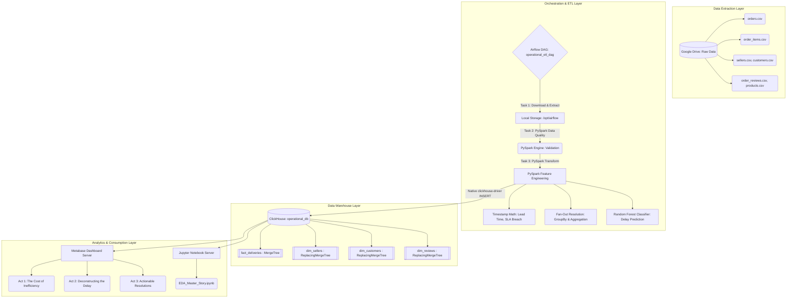

## Data Pipeline & ETL

Our ETL architecture is powered by Apache Airflow orchestrating robust PySpark workloads, specifically designed to process DustiniaDelixia's raw operational data at scale while ensuring strict analytical integrity.

### Data Cleansing and Integrity Validation

The raw data provided by internal tracking systems is inherently noisy and prone to logical errors. During the ETL process, our PySpark `data_quality_checks` task aggressively filters out corrupted records that would otherwise skew operational metrics. Specifically, the system scans the dataset for illogical temporal sequences—for example, it identifies any `order_delivered_customer_date` that occurs chronologically *before* the `order_purchase_timestamp`. The pipeline also validates the absolute uniqueness of primary keys (`order_id`) to ensure there is no duplicate counting. Furthermore, in the transformation stage, missing values are systematically handled. For example, `purchase_hour` is imputed with a median value (12) where missing, and categorical `nulls` in states are coalesced to `'UNKNOWN'` to prevent downstream pipeline failures during the Machine Learning execution phase. Only cleanly formatted, chronologically sound data makes it to the data warehouse.

### Advanced Timestamp Engineering & Bottleneck Mapping

The core value of this pipeline lies in how it mathematically deconstructs the delivery timeline. PySpark converts all raw date columns into UNIX timestamps to calculate precise day-level metrics for every single order:

- **Lead Time (`lead_time_days`):** Calculated as `(order_delivered_customer_date - order_purchase_timestamp) / 86400`. This represents the total end-to-end customer wait time.
- **SLA Breaches (`sla_breach_days` & `is_delayed`):** Calculated as `(order_delivered_customer_date - order_estimated_delivery_date) / 86400`. Any value greater than 0 explicitly triggers the `is_delayed = 1` flag, establishing our foundational failure metric.
- **Accountability Mapping (The "Who is at Fault?" Logic):**
  - *Seller Processing Bottlenecks (`seller_processing_days`):* Calculated from `order_approved_at` to `order_delivered_carrier_date`. This isolates the time the seller takes to physically pack and dispatch the item.
  - *Carrier Transit Bottlenecks (`carrier_transit_days`):* Calculated from `order_delivered_carrier_date` to `order_delivered_customer_date`. This isolates the time the logistics partner takes to move the box across the country.

Finally, the PySpark pipeline utilizes a trained `RandomForestClassifier` (incorporating seller state, customer state, and purchase hour) to append a forward-looking `predicted_delay_probability` to every order, turning a purely descriptive dataset into a predictive one.

## Data Modelling

To ensure this platform operates seamlessly for both Finance and Operations at a massive scale, ClickHouse was selected as the underlying OLAP Data Warehouse. ClickHouse's columnar structure allows it to execute aggregations over hundreds of millions of rows in milliseconds, which is an absolute necessity when slicing logistical routes and freight costs dynamically in Metabase.

### Handling Nullables & Schema Rigidity

Operational tracking data is fundamentally incomplete until an order is fully closed. Orders currently in transit will inherently lack an `order_delivered_customer_date`. Our ClickHouse DDL addresses this reality natively by declaring temporal columns as `Nullable(DateTime)` and calculated metrics as `Nullable(Float32)`. This prevents the ETL from breaking on active orders and avoids the dangerous anti-pattern of inserting "dummy" dates (e.g., `1970-01-01`) which severely corrupts average lead time calculations. The `fact_deliveries` table utilizes the `MergeTree` engine partitioned by `toYYYYMM(order_purchase_timestamp)` to ensure rapid time-series querying. Dimension tables utilize the `ReplacingMergeTree` engine to gracefully handle late-arriving updates to seller or customer metadata without duplicating dimension records.

### Solving Duplication Problem for Finance

A classic failure in e-commerce data warehousing is joining order-level tables directly with item-level tables, creating a "fan-out" effect. If an order has 5 items, a naive SQL join duplicates the order's singular `freight_value` 5 times, artificially inflating Finance's shipping cost metrics by 500%.
Our PySpark logic intercepts and solves this before it ever reaches ClickHouse. We generate a distinct `order_seller_bridge` dataframe by joining `order_items` and `products`, grouping strictly by `order_id` and `seller_id`. We then perform an aggregation: `_sum("freight_value")` and extract the `first("product_category_name_english")`. When this pre-aggregated bridge is left-joined back to the main `orders` table, it guarantees a 1-to-1 relationship, ensuring that total financial distribution costs reported in Metabase are 100% accurate and mathematically sound.

### Insights

The analytical data consumed by Metabase drives a 3-Act executive narrative specifically designed to answer the Head of Operations and the Finance Team's questions. Below are the exhaustive insights generated directly from our ClickHouse data model.

#### Insight: Overall Delivery Delay Rate

- **Target Audience:** Operations Leadership & Executive Suite
- **Business Value:** This is the primary north-star metric. It establishes the baseline failure rate by identifying the exact percentage of total delivered orders that arrived after the system's Estimated Delivery Date. It quantifies the exact scope of the customer complaint crisis.

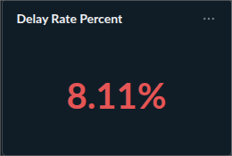

#### Insight: Delay Trend Over Time

- **Target Audience:** Operations Leadership
- **Business Value:** Analyzes logistical performance on a month-over-month basis. This allows the Head of Operations to determine if the delivery crisis is an isolated seasonal spike or a systemic deterioration of the supply chain over the year.

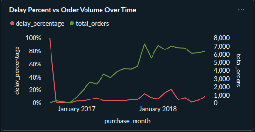

#### Insight: Delays vs Customer Reviews

- **Target Audience:** Customer Experience & Operations
- **Business Value:** Proves the direct financial and reputational cost of logistical failure by cross-referencing operational facts with dimensional review data. It tangibly demonstrates how much a delayed delivery drops the average out-of-5 customer review score compared to an on-time delivery.

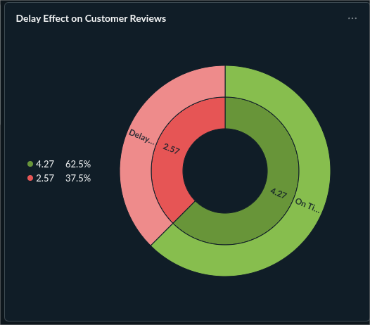

#### Insight: Seller Processing vs Carrier Transit Breakdown

- **Target Audience:** Operations & Vendor Management
- **Business Value:** This is the most critical operational deconstruction chart. By stacking the average Seller Processing Days against Average Carrier Transit days over time, Operations can definitively blame either the sellers (for packing slowly) or the logistics partners (for driving slowly), putting an end to finger-pointing.

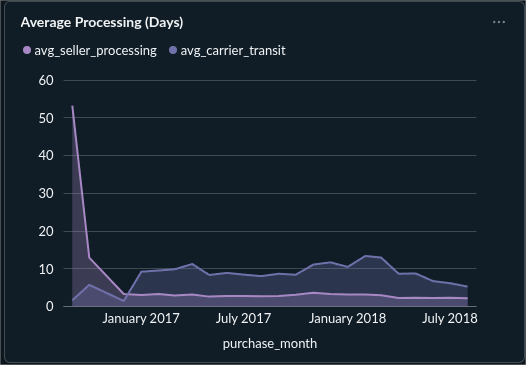

#### Insight: Customer State and Seller State Volume vs Delay Rate

- **Target Audience:** Regional Operations Managers
- **Business Value:** Identifies geospatial bottlenecks. It highlights if the delivery crisis is a localized infrastructure failure in specific distant states or a nationwide problem. It compares actual lead times against the delay days by territory.
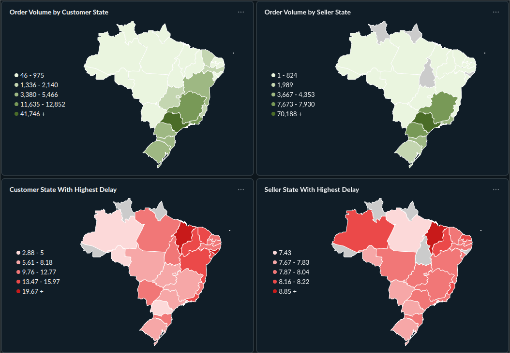

#### Insight: Worst Performing Logistical Routes

- **Target Audience:** Operations & Logistics Dispatch
- **Business Value:** Isolates the exact supply chain routes (e.g., Seller State A -> Customer State B) that suffer from the highest delay rates. Operations can use this to disable specific long-distance fulfillment paths that consistently fail to meet customer expectations.

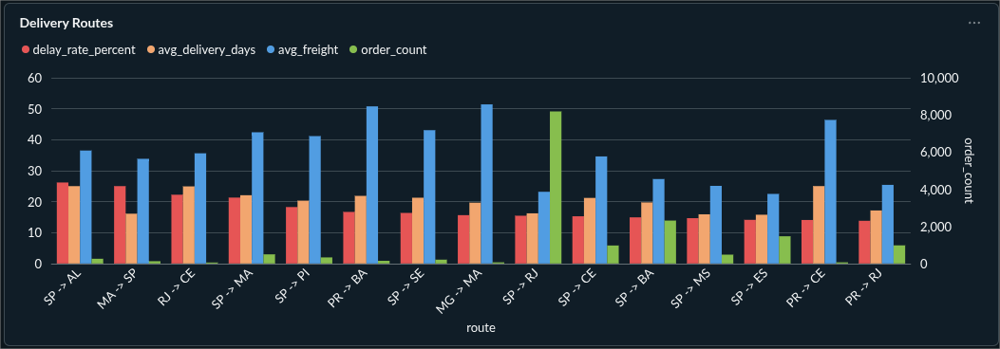

#### Insight: Purchase Hour vs Delay Rate

- **Target Audience:** Warehouse Operations
- **Business Value:** Explores the correlation between the time-of-day an order is placed and its likelihood of being delayed. This pinpoints operational "cutoff time" failures—for instance, if late-night orders sit unprocessed for an entire extra day, warehouse shift schedules must be adjusted.

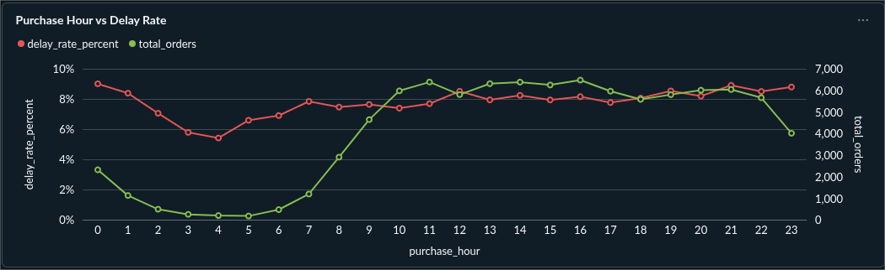

#### Insight: Top 10 Bottleneck Sellers

- **Target Audience:** Vendor Management
- **Business Value:** Answers the direct complaint regarding "several large sellers." This query lists the absolute worst-offending individual sellers based on their average processing times. Vendor managers can use this list to directly enforce penalties or provide targeted logistical training to specific merchants.

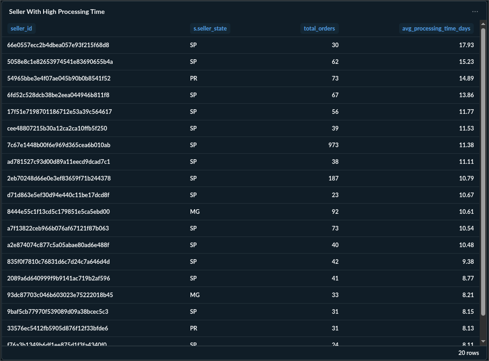

#### Insight: Freight Efficiency

- **Target Audience:** Finance & Logistics Procurement
- **Business Value:** Directly answers Finance's demand for distribution efficiency. It plots the actual cost of freight against the total delivery lead time. If the data shows that high freight values do *not* yield proportionately faster delivery times, Finance has hard evidence to renegotiate carrier contracts and optimize shipping tier pricing.

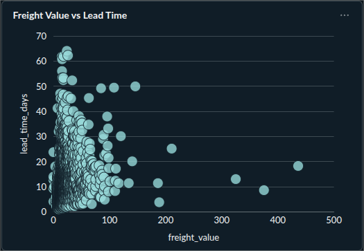

#### Insight: Delivery Failure Rate (Cancellations/Unavailable)

- **Target Audience:** Operations Leadership
- **Business Value:** Evaluates the pre-delivery attrition rate. It tracks the volume of orders that never make it to the final customer because they were canceled or deemed unavailable by the carrier, representing a complete loss of revenue and wasted operational effort.

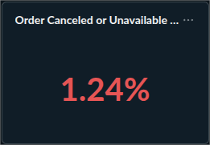

### 5. HOW TO RUN THE INFRASTRUCTURE

To deploy the complete Operational Analytics stack locally (Apache Airflow, Apache Spark, ClickHouse, and Metabase), execute the following commands in the root directory:

```bash
# Spin up all Dockerized services in detached mode
docker compose up -d

# Check the status of the containers to ensure successful initialization
docker compose ps
```

The Airflow Web UI will be accessible at `localhost:8080` to trigger the ETL DAG, and Metabase will be accessible at `localhost:3000` to visualize the ClickHouse warehouse data.
